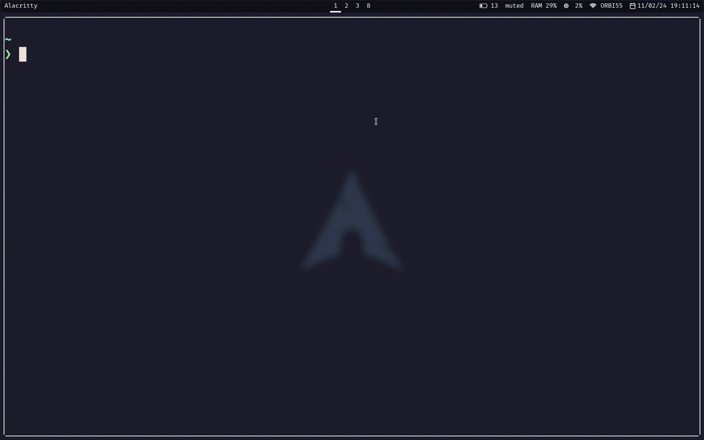

# TODOTEA

__todotea__ is an simple cli-todolist made with [bubbletea](https://github.com/charmbracelet/bubbletea)



## Installation
- you need to have [go](https://go.dev/doc/install) installed
`
```bash
git clone https://github.com/AdrianETP/TodoTea.git
```

```bash
cd TodoTea
```

```bash
go build
```

```bash
./install.sh
```
